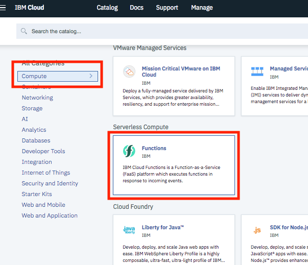
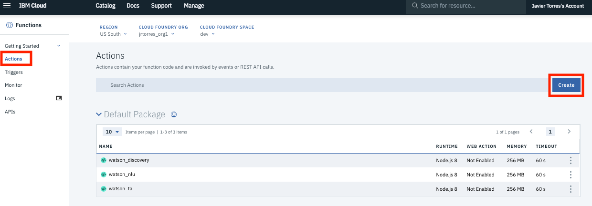
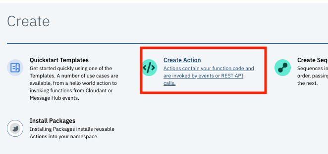
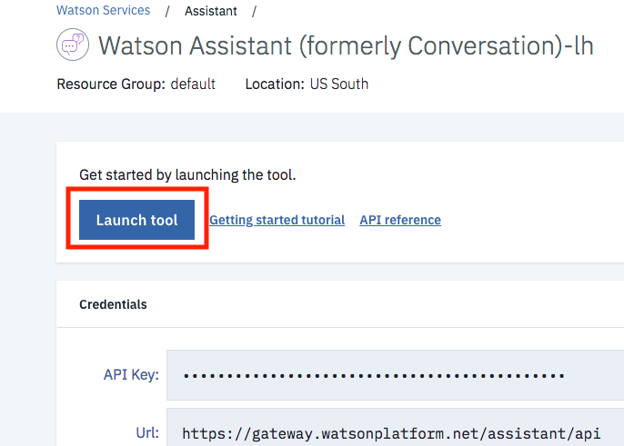
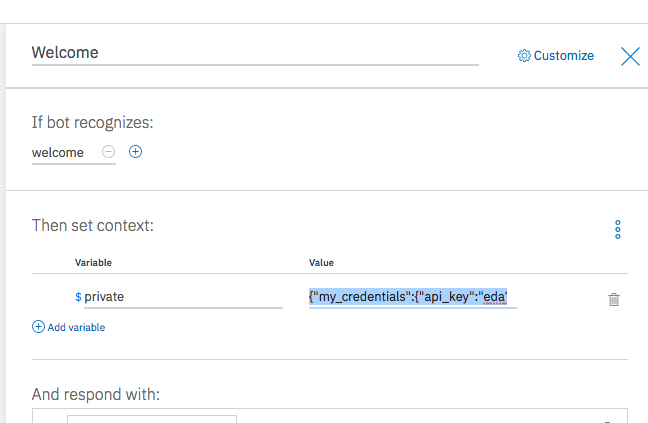

# Watson Assistant Lab - Part 2: Extending the bot

Sign up for an [IBM Cloud account](https://console.cloud.ibm.com). If you already have an account, sign into your account.

## Step 1: Create a Cloud Function

First we will create a cloud function that will call the Natural Language Classifier (NLC) service. You should have created an NLC model in a prior lab or receive access details for a pre-created classification model separately. This section will assume you have a model details that can be used by the cloud function.

01. Click on the **Catalog** link in the top-left corner of the IBM Cloud dashboard.

02. Select the **Compute** category on the left, under 'All Categories'.

03. Select the **Functions** service tile under Serverless Compute.
   

04. Click on **Actions** link on the left panel and then the **Create** button.
   

05. Select the **Create Action** option
   

06. Give your action a Name (i.e `watson_nlc`) and select a Node.js 8 runtime. Then click the **Create** button.
   

07. Paste the node.js code to call the NLC service ( copy it from [nlc_classify_function.js](functions/nlc_classify_function.js)) and click the **Save** button.
   

08. You now need to add parameters to your action which incude the credentials to access the NLC service as well as the specific classifier id to invoke. Click on the **Parameters** option from the left panel. Then add parameters as shown below. Be sure to click the **Add** button to add each parameter and ensure you enclose all parameter values in quotes. Make sure to click the **Save** button when you have added the parameters.
   

09. You can now test your NLC cloud function. Go back to the Code page by clicking on the **Code** link on the left panel. Click on the **Change input** button to supply a sample piece of text to classify and then click on the **Apply** button. You can then click on the **Invoke** button and see results pop up on the right **Activations** panel.
   
   

10. Go ahead and clear the sample input you entered in the step above.  

\
We now need to gather some details for our cloud function that we will use later in the Watson Assistant (save these details for the next section)
01. Click on the **Endpoint** option on the left panel. The action name that needs to be saved is at the end of the url:
   

02. Click on the **API-KEY** link in the REST API section.

03. Click on the eye icon on the right hand side to show your cloud functions API key. Copy and save this value for later
   

\

## Step 2: Extend the chatbot

Now lets extend our dialog to cover an additional scenario around claims. We will assume that in order to intiate a claim, a user will supply the date of the service and a description of the service. We will use the description of the service to look up an appropriate ICD-10 code by invoking the cloud function and NLC classifier. 

01. Go to your IBM Cloud console and select your Watson Assistant Service (complete Part1 of the lab or import the Part1 workspace file if necessary). 

02. Click on the  **Launch tool** button to launch into the Watson Assistant tooling.
   

03. Click the **Intents** tab, click on **Add intent** to create a new intent to intiate claims.

04. Name the intent *Initiate_Claim* and click **Create intent**
   

05. Add the example utterances shown in the screenshot below, clicking on **Add example** after entering each one
   

06. Click on the return icon to go back to the main menu screen

07. Next, lets add the dialog nodes. Click on the **Dialog** tab in the top menu bar. Select the Welcome node and click **Add node**. In the dialog node editor, enter a node name (i.e 'Start Claim'). For the input triggers, have it set to when the intents **#Initiate_Claim** is identified. In the response, add a text response as shown below.
   

08. There are two pieces of information we will gather for this scenario. We will need the date of the service the description of the service. Although, we could capture this all with a single node using the Slots capability, we are going to use child nodes. Select the 'Start Claim' node you created above and then click the **Add child node** button.  In the dialog node editor, enter a node name (i.e. 'Service Date'). For the input triggers, have it set to the entity type **@sys-date**. In the response, add a text response as shown below. Finally, we also want to store this date in the context, so click on the three dots next to the 'Then respond with' header and select 'Open context editor'. Save the date as shown below  
     

   Go ahead and also add another child node at this level. Select the 'Start Claim' node you created above and then click the **Add child node** button.  In the dialog node editor, enter a node name 'Re-prompt Claim Date'. For the input triggers, have it set to `true`. In the response, add a text response as shown below. Then in the 'And finally' section, select the **Jump to** option and select the 'Service Date' node with the option **Wait for user input**. Your dialog should look as shown below.  
     

   Your dialog tree should now look like this:  
   

09. The next level of dialog will take the users description and attempt to classify it. Select the 'Service Date' node you created above and then click the **Add child node** button.  In the dialog node editor, enter a node name 'Classify Description'. For the input triggers, have it set to `true`. Next to the 'Then respond with:' header, click the three vertical button icon and select the **Open JSON editor** option
   

10. Copy and Paste the following JSON into the editor:

   ```JSON
   {
     "context": {
       "claim_service_description": "<?input.text?>"
     },
     "output": {
       "generic": []
     },
     "actions": [
       {
         "name": "/jrtorres_org1_dev/actions/watson_nlc",
         "type": "cloud_function",
         "parameters": {
           "text": "<?input.text?>"
         },
         "credentials": "$private.my_credentials",
         "result_variable": "context.watson_nlc_output"
       }
     ]
   }
   ```

   Note that the **'name'** value in the JSON should be updated with the name of your own cloud function (saved from Section 1 above)
   

11. Lets add another node to process the results of the classification call. Select the 'Classify Description' node you created above and then click the **Add child node** button.  In the dialog node editor, enter a node name 'Save Claim Request'. For the input triggers, have it set to `true`. Next to the 'Then respond with:' header, click the three vertical button icon and select the **Open JSON editor** option. Then replace the contents with the following JSON object (this saves the code and provides the user a response):

   ```JSON
   {
      "context": {
         "claim_service_topicd10code": "<? context.full_nlc_output.classes.get(0).class_name ?>"
      },
      "output": {
         "generic": [{
            "values": [{
               "text": "I have your claim request from $claim_service_date and an identified code of $claim_service_topicd10code"
            }],
            "response_type": "text",
            "selection_policy": "sequential"
        }]
      }
   }
   ```

12. To link the classification call and response processing nodes together. Select the 'Classify Description' node and click the three vertical dots on the node. Select the **Jump to** option and the subsequent **If bot recognizes (condition)** option.
   

13. The completed dialog section should look as follows:
   

14. Before we can test our claim process and classification, we need to provide the API Key to be able to call the Cloud Functions. In a real application, the credentials or key would be passed to Watson Assistant from the client application. For the purposes of this lab, we can put the API key directly in the dialog. We will add the key to the 'Welcome' Node so that it is set up in our context any time a conversation is started with this workspace. Select the 'Welcome' node in the dialog tree.

15. Click the three horiztonal dots next to 'Then respond with:" header and click on **Open context editor**

16. Add a variable name `private` with a value of `{"my_credentials":{"api_key":"REPLACE_WITH_YOUR_API_KEY"}}`. Make sure you actually replace the value 'REPLACE_WITH_YOUR_API_KEY' with your actual api key, saved from section 1 above.
   

17. Now you can test the chatbot via the 'Try it out' panel.
   

18. Feel free to test the chatbot via the client application as described in the [README](README.md)

19. ***{Optional]*** As an additional exercise, you can also experiment with adding an entity in Watson Assistant to capture the ICD10 code. Watson Assistant allows users to define a regular expression to capture entity values. You can use that to determine if an end user provided an ICD-10 code and bypass the classification steps. Here is a sample of what an ICD10 entity value might look like:
   

20. **When complete with the lab exercise, do not forget to remove your API key from the Welcome node.**