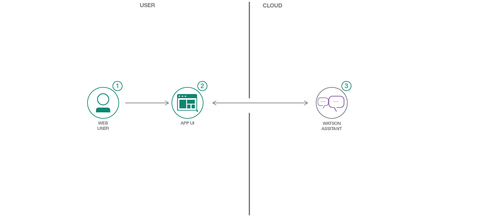
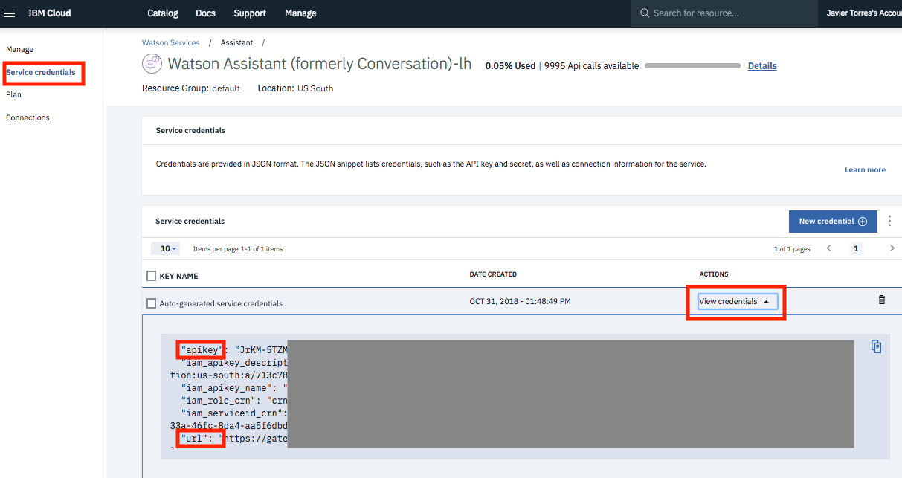

# Introduction to Watson Assistant

## Overview

Watson Assistant service combines machine learning, natural language understanding, and integrated dialog tools to create conversation flows between your apps and your users. In this lab, you will create a workspace and understand the terminology of creating a chatbot.

This application is based on the code pattern published here - [Slot Code Pattern](https://developer.ibm.com/patterns/assemble-a-pizza-ordering-chatbot-dialog/) and the [Watson Assistant Simple application](https://github.com/watson-developer-cloud/assistant-simple)

### Flow

1. User sends messages to the application (running locally or on IBM Cloud).
2. The application sends the user message to IBM Watson Assistant service, and displays the ongoing chat in a web page.

   

### Featured Technologies

* [IBM Watson Assistant](https://www.ibm.com/watson/developercloud/conversation.html): Build, test and deploy a bot or virtual agent across mobile devices, messaging platforms, or even on a physical robot.
* [Node.js](https://nodejs.org/): An asynchronous event driven JavaScript runtime, designed to build scalable applications.

### Prerequisites

* Clone this `watson-assistant-lab` repository locally. From a terminal or command window, run:

  `$ git clone https://github.com/jrtorres/watson-assistant-lab.git`

## Building the bot

### Part 1: Create the basic structure

Complete the steps in [Build the bot from scratch](PART1_BUILDBOT.md) to build the basic chatbot.
Once you're done, go ahead and test the chatbot using the [simple client application](#run-the-application).

### Part 2: Extend the bot

Now we will extend the chatbot with a couple of external service calls. Complete the steps in [Extend the bot](PART2_EXTENDBOT.md).
Once you're done, go ahead and test the chatbot using the [simple client application](#run-the-application).

## Run the Application

### Run locally

Complete the steps outlined [above](#building-the-bot) to build the chatbot from scratch. Alternatively, you can Launch the **Watson Assistant** tool and use the `import` icon button on the right to import the completed chat bot workspace.


Find the desired local version of the workspace JSON file [Part 1 Workspace](training/plan-bot-part1.json) or [Part 2 Workspace](training/plan-bot-part1.json) and select `Import` (make sure you import everything).

#### 1. Add IBM Cloud service credentials and Workspace ID to .env file

1. As you create the IBM Cloud services, you'll need to use the service credentials to interact with these services. You might get either IAM or username/password based credentials based on the region. To find these credentials, from the IBM cloud console, click on the Watson Assistant service instance you created and click on **Service credentials**

   

2. In the application folder, copy the *.env.example* file and create a file called *.env*

    ```
    cp .env.example .env
    ```

3. Open the *.env* file and add the service credentials that you obtained in the previofirstus step. The Watson SDK automaticaly locates the correct enviromental variables for either `username`, `password`, and `url` or the `apikey` and `url` credentials found in the *.env* file.

   * If your service instance uses `username` and `password` credentials, add the `ASSISTANT_USERNAME` and `ASSISTANT_PASSWORD` variables to the *.env* file.

    ```
    ASSISTANT_USERNAME=XXXXXXXXXXXXXXXX
    ASSISTANT_PASSWORD=XXXXXXXXXXXXXXXX
    ASSISTANT_URL=https://gateway.watsonplatform.net/assistant/api
    ```

   * If your service instance uses an IAM API key, copy the `apikey` and `url` to the relevant fields.

    ```
    ASSISTANT_IAM_APIKEY=ca2905e6-7b5d-4408-9192-e4d54d83e604
    ASSISTANT_IAM_URL=https://gateway-syd.watsonplatform.net/assistant/api
    ```

4. To interact with the chatbot, you will need the unique identifier for your workspace.  You can find this workspace ID in the deploy tab of the Watson Assistant tooling.

     

   Copy this id to the `WORKSPACE_ID` property in the .env file:

    ```
    WORKSPACE_ID=522XXXXXXXXXXXXXXXXXX
    ```

#### 2. Start the application

From a terminal, in the directory where you cloned the GIT repository, run the following commands:

1. Install the dependencies

    ```
    npm install
    ```

2. Run the application

    ```
    npm start
    ```

3. View the application in a browser at `localhost:3000`

### Deploying to IBM Cloud as a Cloud Foundry Application

1. Login to IBM Cloud with the [IBM Cloud CLI](https://console.bluemix.net/docs/cli/index.html#overview)

    ```
    ibmcloud login
    ```

2. Target a Cloud Foundry organization and space.

    ```
    ibmcloud target --cf
    ```

3. Edit the *manifest.yml* file. Change the **name** field to something unique.  
  For example, `- name: my-app-name`.

4. Deploy the application

    ```
    ibmcloud app push
    ```

5. View the application online at the app URL. For example: `https://my-app-name.mybluemix.net`

# Troubleshooting

* Deploy using Cloud Foundry `cf push` gives:

``FAILED
Could not find service <Watson_service> to bind to <IBM_Cloud_application>``

So, there are 2 ways you can get this to work:

* Change the names of your IBM Cloud services to match the names in the manifest.
* Change the names in the manifest to match the names of your IBM Cloud services.

# License

This sample code is licensed under Apache 2.0.  
Full license text is available in [LICENSE](LICENSE).

# Links

* [IBM Watson Assistant Docs](https://console.bluemix.net/docs/services/conversation/dialog-build.html#dialog-build)
* [Blog for IBM Watson Assistant Slots Code Pattern](https://developer.ibm.com/code/2017/09/19/managing-resources-efficiently-watson-conversation-slots/)

# Learn more

* **Artificial Intelligence Code Patterns**: Enjoyed this Code Pattern? Check out our other [AI Code Patterns](https://developer.ibm.com/code/technologies/artificial-intelligence/).
* **AI and Data Code Pattern Playlist**: Bookmark our [playlist](https://www.youtube.com/playlist?list=PLzUbsvIyrNfknNewObx5N7uGZ5FKH0Fde) with all of our Code Pattern videos
* **With Watson**: Want to take your Watson app to the next level? Looking to utilize Watson Brand assets? [Join the With Watson program](https://www.ibm.com/watson/with-watson/) to leverage exclusive brand, marketing, and tech resources to amplify and accelerate your Watson embedded commercial solution.
* **Kubernetes on IBM Cloud**: Deliver your apps with the combined the power of [Kubernetes and Docker on IBM Cloud](https://www.ibm.com/cloud-computing/bluemix/containers)
